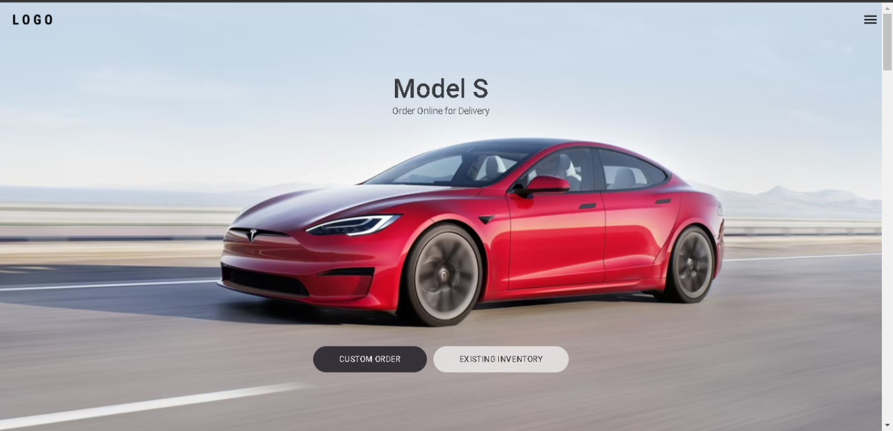
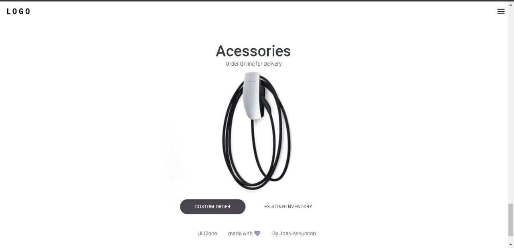

# Repo to Tesla website clone!

 
 

 
 

## [Application link]()

 
 
 

## Contact:

 

<a href="https://linkedin.com/in/Joas-Assuncao">

- 

</a>

 
 
 
 

## Languages and Libs:

 

<a href="https://www.typescriptlang.org/">

- 

</a>

 

<a href="https://pt-br.reactjs.org/">

- 

</a>

 
 
 
 

## Inspiration:
 

<a href="https://tesla.com/">

- 

</a>

 

<a href="https://www.youtube.com/watch?v=Mf4Se4ZGcG8">

- 

</a>

<!-- <h1 align="center">
    
     
    Tesla website clone!
     
</h1>

  

  

  
  

  

  

  

## :rocket: Technologies

This project was developed with the following technologies:

- [React](https://pt-br.reactjs.org/)
- [Typescript](https://www.typescriptlang.org/)
- [Framer Motion](https://www.framer.com/motion/)
- [Tesla](https://www.tesla.com)
- [UI Clone](https://www.youtube.com/watch?v=Mf4Se4ZGcG8) -->